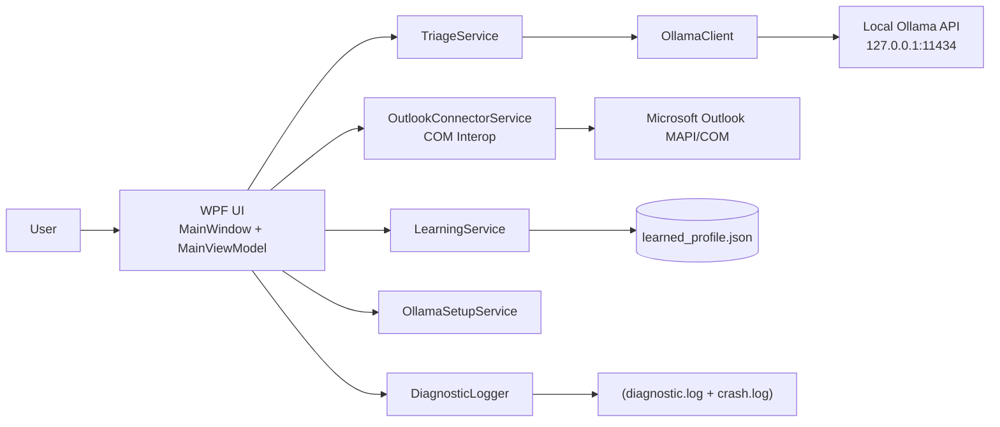
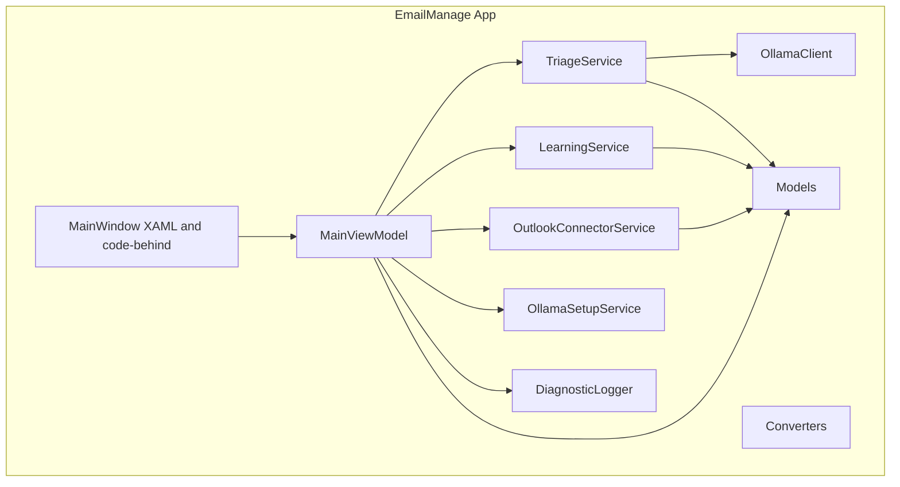
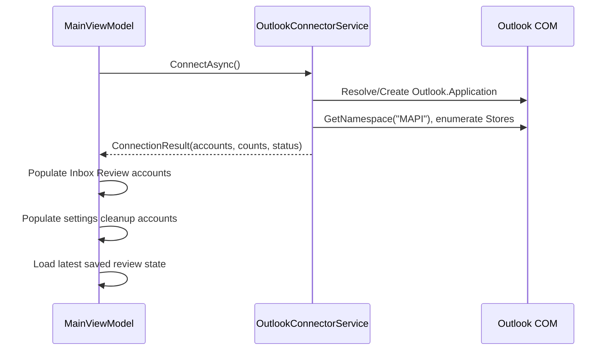
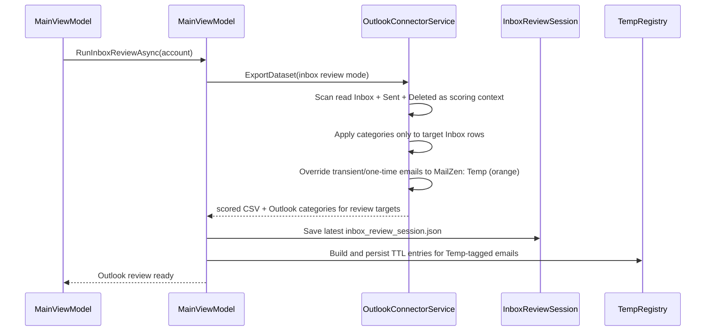
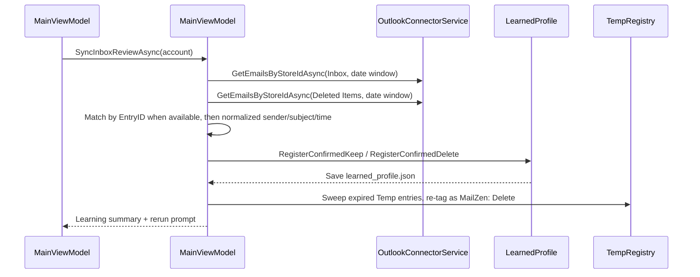
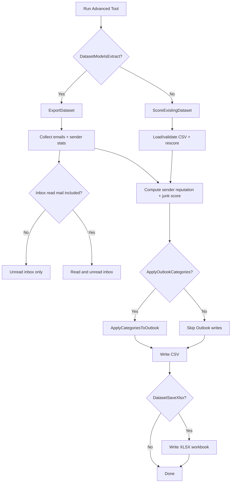

# MailZen Architecture and User Manual

## Document Control
- Product: MailZen
- Software Version: `1.4.1`
- Document Version: `1.4.1`
- Last Updated: `2026-03-14`
- Repository Path: `src/EmailManage.App`

Version sync rule:
- Keep `Software Version` and `Document Version` identical.
- When code changes in a release, update both:
1. `src/EmailManage.App/EmailManage.App.csproj` `<Version>`
2. This file header (`Software Version`, `Document Version`, `Last Updated`)
3. Visible UI version (bound from assembly metadata in `MainViewModel.AppVersion`)

---

## 1. Purpose and Scope
This document is the single technical reference for:
- How MailZen is designed.
- Where each capability lives in code.
- How to safely modify behavior.
- How to operate the product as an end user.

Audience:
- New developers joining the project.
- Maintainers changing workflow, scoring, Outlook COM interactions, AI behavior, or UI.
- Product owners and QA validating releases.

---

## 2. Solution Overview
MailZen is a Windows WPF desktop app that helps users clean Outlook email using:
- Rule-based dataset scoring.
- Outlook-first Inbox Review with `MailZen: Keep`, `MailZen: Review`, `MailZen: Delete`, and `MailZen: Temp` categories.
- Internal scoring context from read Inbox, Sent Items, and Deleted Items within the selected date range.
- Review-and-relearn feedback based on what the user ultimately keeps in Inbox or deletes in Outlook.
- Advanced export and CSV re-score tools for analysis and backtesting.

Current product direction:
- The visible UI is centered on the `Inbox Review` tab.
- Legacy AI cleanup workflow services still exist in code, but the active product flow now favors category-based Outlook review instead of moving mail into review folders.

Core design characteristics:
- Single UI shell (`MainWindow.xaml`) using MVVM.
- One orchestrator ViewModel (`MainViewModel.cs`).
- Service layer for Outlook COM, learning, AI calls, setup, diagnostics.
- Local-first storage under `%LOCALAPPDATA%\EmailManage`.
- Strong operational logging and crash capture.

---

## 3. High-Level Architecture
### 3.1 Context Diagram


### 3.2 Container/Module Diagram


---

## 4. Repository and File Map
Top-level:
- `src/EmailManage.sln`: Solution entry.
- `src/EmailManage.App/EmailManage.App.csproj`: Dependencies, build metadata, product version (`1.4.1`).
- `MailZen.bat`: Build-and-run helper that publishes a fresh root `MailZen.exe`.
- `Docs/`: Product documentation.
- `Docs/MailZen.wiki/`: Local clone of the companion GitHub wiki repo for quick-start project pages and simplified Mermaid onboarding diagrams that must stay aligned with this manual.
- `.vscode/`: Personal editor/export settings are intentionally not source-controlled project state.

Important app files:
- `src/EmailManage.App/App.xaml`: Resource dictionary and converters.
- `src/EmailManage.App/App.xaml.cs`: Startup/shutdown, global exception handling.
- `src/EmailManage.App/MainWindow.xaml`: Primary UI definition.
- `src/EmailManage.App/MainWindow.xaml.cs`: Window wiring and lifecycle hooks.
- `src/EmailManage.App/ViewModels/MainViewModel.cs`: App workflow state + command orchestration.

Services:
- `src/EmailManage.App/Services/OutlookConnectorService.cs`: Outlook COM operations and dataset/scoring engine.
- `src/EmailManage.App/Services/LearningService.cs`: Deleted-item learning profile generation.
- `src/EmailManage.App/Services/TriageService.cs`: AI-based inbox triage flow.
- `src/EmailManage.App/Services/OllamaClient.cs`: Ollama API calls and JSON parsing.
- `src/EmailManage.App/Services/OllamaSetupService.cs`: Ollama install/start/update/model pull.
- `src/EmailManage.App/Services/DiagnosticLogger.cs`: Structured logging.

Models:
- `OutlookAccountInfo.cs`: Account/store metadata.
- `EmailMessageInfo.cs`: Email transport object from Outlook.
- `FolderEmailSnapshot.cs`: Review folder snapshots.
- `LearnedProfile.cs`: Persistent personalization profile.
- `ConnectionResult.cs`: Connect status and account list.
- `ColorTestEmailItem.cs`: Color test preview item.
- `TempRegistry.cs`: Per-account TTL registry for `MailZen: Temp` tagged emails; auto-expires entries to `MailZen: Delete` during Sync.

---

## 5. Runtime Lifecycle
1. `App.OnStartup` initializes logger, hooks unhandled exception handlers, shows `MainWindow`.
2. `MainWindow` restores saved window size/position/maximized state from local storage and constructs `MainViewModel`.
3. `Window_Loaded` calls `MainViewModel.InitializeAsync()`.
4. ViewModel connects to Outlook and hydrates account-dependent UI collections.
5. User executes Inbox Review, advanced export/re-score, and settings utilities.
6. `Window_Closing` persists the current window layout.
7. `Window_Closed` calls `MainViewModel.Cleanup()`.
8. `App.OnExit` flushes logger.

Error capture:
- Unhandled UI exceptions: `DispatcherUnhandledException` -> `crash.log` + dialog.
- Domain exceptions: `AppDomain.UnhandledException` -> `crash.log`.

---

## 6. Core Workflows (Low-Level)
### 6.1 Connect and Account Discovery


### 6.2 Categorize Inbox for Outlook Review


### 6.3 Sync Review + Relearn


### 6.4 Advanced Tools


### 6.5 Settings + Category Cleanup
- Settings overlay path:
1. User opens the gear icon from the header.
2. MailZen shows AI status, connected accounts, learned profile stats, diagnostics, and output folder controls.
3. Reset Profile operates on the currently selected Inbox Review account.

- Global Inbox cleanup path:
1. `ClearInboxCategoriesCommand` confirms with user.
2. `ClearMailZenCategoriesFromInbox()` scans all Inbox items in selected stores.
3. Strips categories prefixed with `MailZen:`.
4. Optionally removes `MailZen:` view AutoFormatRules.

---

## 7. Data and Storage Contracts
### 7.1 Local Paths
- Logs: `%LOCALAPPDATA%\EmailManage\diagnostic.log` (rolling daily, keep 14 files)
- Crash log: `%LOCALAPPDATA%\EmailManage\crash.log`
- Learned profile: `%LOCALAPPDATA%\EmailManage\accounts\<accountKey>\learned_profile.json`
- Latest inbox review session: `%LOCALAPPDATA%\EmailManage\accounts\<accountKey>\inbox_review_session.json`
- Dataset defaults: `%LOCALAPPDATA%\EmailManage\dataset_defaults.json`
- Window layout: `%LOCALAPPDATA%\EmailManage\window_state.json`
- Temp TTL registry: `%LOCALAPPDATA%\EmailManage\accounts\<accountKey>\temp_registry.json`

### 7.2 LearnedProfile Schema
`LearnedProfile` fields:
- `AccountKey`
- `LearnedAt`
- `TotalDeletedScanned`
- `DeletedSenderCounts: Dictionary<string,int>`
- `DeletedDomainCounts: Dictionary<string,int>`
- `DoNotDeleteSenders: HashSet<string>`
- `RuleCreatedSenders: HashSet<string>`

Feedback behavior:
- `RegisterConfirmedKeep(sender, domain)` protects senders and reduces delete bias.
- `RegisterConfirmedDelete(sender, domain)` increases future delete bias for the same sender/domain.

### 7.3 InboxReviewSession Schema
`InboxReviewSession` fields:
- `AccountKey`
- `StoreId`
- `StoreName`
- `EmailAddress`
- `DatasetCsvPath`
- `CreatedAt`
- `SourceStartDate`
- `SourceEndDate`
- `TotalInboxItems`
- `KeepCount`
- `ReviewCount`
- `DeleteCount`
- `TempCount`
- `LastSyncedAt`
- `Items: List<InboxReviewSessionItem>`

Each `InboxReviewSessionItem` stores:
- `EntryId`
- `SenderEmail`
- `Subject`
- `ReceivedTime`
- `Recommendation`
- `JunkScore`

### 7.4 TempRegistry Schema
`TempRegistry` fields:
- `AccountKey`  matches the account key used in the directory path.
- `Entries: Dictionary<string, DateTime>`  maps `EntryId` (case-insensitive) to UTC expiry time.

Behavior:
- Rebuilt fresh on each `Categorize Inbox` run; entries from prior runs are cleared.
- Expiry time = `DateTime.UtcNow + DefaultTempTtlHours` (default 48 h, user-configurable in Settings > General).
- During `Sync Review + Relearn`, expired entries (`ExpiryUtc <= UtcNow`) are detected; the corresponding Outlook items are re-tagged from `MailZen: Temp` to `MailZen: Delete`, then removed from the registry.
- Stored as JSON; resilient to missing file (returns empty registry on first load).

### 7.5 Dataset CSV Contract
Required columns are validated by `OutlookConnectorService.RequiredCsvColumns`.
For Inbox Review runs, the saved CSV contains only the Inbox emails that were actually tagged for review; read Inbox, Sent Items, and Deleted Items that were used only as scoring context are kept internal.
Output scored columns append:
- `SenderReputation`
- `JunkScore`
- `Recommendation`

---

## 8. Scoring Architecture
Current implementation is heuristic and code-defined (not user-tunable in UI):
- Sender reputation is derived from observed behaviors (read/delete/reply/unsubscribe patterns).
- Junk score combines signals such as unsubscribe presence, bulk indicators, folder context, and sender reputation.
- Inbox Review always gathers read Inbox, Sent Items, and Deleted Items in the selected range as scoring context, even when only unread Inbox mail is being tagged for review.
- Inbox Review relearn applies a feedback layer from `LearnedProfile`:
1. `DoNotDeleteSenders` caps future scores toward `Keep`
2. Confirmed delete sender/domain counts push future scores toward `Delete`
- Recommendation thresholds map score to Keep/Review/Delete.
- Transient/one-time emails are detected by `IsTransientEmail(senderEmail, subject)` (internal static, `OutlookConnectorService`). Pattern matching checks sender-address prefixes (e.g. `otp@`, `verify@`, `signin-noreply@`, `no-reply@`) and subject keywords (e.g. `verification code`, `one-time password`, `device authorization`, `booking confirmation`). Matching items are overridden to `MailZen: Temp` regardless of the computed junk score.

Primary file:
- `src/EmailManage.App/Services/OutlookConnectorService.cs`

Change guidance:
- For algorithm changes, modify only calculation functions and keep dataset column contract stable.
- If column names change, also update CSV validation and any data-science consumers.

---

## 9. Outlook COM and Threading Model
MailZen uses dynamic COM interop with STA requirements:
- COM work is wrapped in dedicated STA threads (`SetApartmentState(ApartmentState.STA)`).
- `RetryMessageFilter` is used to handle transient COM busy states.
- COM objects are explicitly released with `Marshal.ReleaseComObject`.

Safety notes:
- Cross-session `GetItemFromID` can fail depending on store/provider; where needed, code uses inbox iteration by `EntryID` matching instead.
- AutoFormatRules may fail for some account types (especially IMAP). The app handles this as best effort and logs warnings instead of hard failing core actions.

---

## 10. AI Integration Architecture
- Local endpoint: `http://127.0.0.1:11434`.
- Model default: `gemma3:4b`.
- Prompt strategy:
1. System instruction to return strict JSON only.
2. User prompt with sender, subject, body preview, unsubscribe hint.
3. Optional user-specific learned context prepended from `LearnedProfile`.

Robustness:
- Timeout handling.
- Parse fallback for markdown-wrapped JSON responses.
- Classification failures return error state instead of crashing workflow.

---

## 11. UI Architecture and Navigation
Main areas:
- Top Header: app identity, version badge, connection pill, settings gear.
- Single visible main tab: `Inbox Review`.
- Inbox Review card: categorize Inbox, review in Outlook, sync review + relearn.
- Advanced Tools card: Outlook export and CSV re-score actions.
- Settings Overlay: AI, accounts, profile, diagnostics, output folder, global inbox cleanup.

MVVM binding patterns:
- Most actions are `[RelayCommand]` methods in `MainViewModel`.
- Boolean state controls visibility and command availability.
- Value converters are in `Helpers/Converters.cs`.

---

## 12. Developer Start Guide
If you need to change X, start in Y:
- Outlook connectivity, folder operations, moving emails -> `OutlookConnectorService.cs`
- AI prompt/classification behavior -> `OllamaClient.cs`
- Learn logic and profile persistence -> `LearningService.cs`, `LearnedProfile.cs`
- Inbox Review session + sync/relearn flow -> `MainViewModel.cs`, `InboxReviewSession.cs`, `LearnedProfile.cs`
- Temp email TTL detection/expiry -> `OutlookConnectorService.cs` (`IsTransientBySubjectKeyword`, `IsTransientBySenderPrefix`, `IsTransientEmail`, `ExpireTempEmailsAsync`), `TempRegistry.cs`, `MainViewModel.cs`
- Dataset extraction/scoring outputs -> `OutlookConnectorService.cs`, `MainViewModel.cs`, `MainWindow.xaml`
- Settings UI and new controls -> `MainWindow.xaml`, `MainViewModel.cs`
- Version shown in UI -> `EmailManage.App.csproj`, `MainViewModel.cs`, `MainWindow.xaml`
- Logging format/retention -> `DiagnosticLogger.cs`

---

## 13. Build, Release, and Versioning Process
### 13.1 Build/Publish
Preferred local build-and-run command:
```bat
MailZen.bat
```

Equivalent publish command:
```powershell
dotnet publish src/EmailManage.App/EmailManage.App.csproj -c Release -r win-x64 --self-contained true -p:PublishSingleFile=true -p:IncludeNativeLibrariesForSelfExtract=true -o bin/Release/single-file
```

Result:
- Published single-file executable is copied to repository root as `MailZen.exe`.

### 13.2 Release Version Bump Checklist
For each release:
1. Update `<Version>` in `src/EmailManage.App/EmailManage.App.csproj`.
2. Verify header version shows in app title area and status bar.
3. Update this document header (`Software Version`, `Document Version`, date).
4. Update the GitHub wiki pages affected by the release.
5. Publish and smoke test.
6. Tag release in git.

Recommended semantic versioning:
- Patch: bug fix, no behavior contract break (`1.1.1 -> 1.1.2`)
- Minor: backward-compatible feature addition (`1.2.0 -> 1.3.0`)
- Major: breaking change (`1.x -> 2.0.0`)

### 13.3 Documentation Tooling Notes
- The product source of truth remains the application code, this manual, and the aligned GitHub wiki pages.
- Personal VS Code settings for Markdown export are local environment details and are not part of the tracked MailZen software version.
- Generated HTML exports and working screenshot captures are documentation artifacts, not product binaries or release metadata.
- If Mermaid HTML export differs across machines, treat that as a local documentation-tooling issue first and verify the editor extension setup separately from the MailZen app version.

---

## 14. User Manual
### 14.1 Prerequisites
- Windows machine with Microsoft Outlook profile configured.
- Outlook data stores accessible (Exchange/IMAP/Outlook.com/PST as supported by Outlook).
- For AI features: Ollama installed and running locally, model available.

### 14.2 First Run
1. Launch MailZen.
2. Wait for connection status to become connected.
3. Open settings (gear) and verify AI status.
4. If AI is not ready, click install/setup controls in Settings.
5. On later launches, the main window reopens with the same size, position, and maximized state the user last used.

### 14.3 Inbox Review Workflow
1. In the `Inbox Review` tab, select exactly one Outlook account.
2. Choose the date range and decide whether read Inbox emails should also be tagged for review.
3. Click `Categorize Inbox`.
4. MailZen uses read Inbox, Sent Items, and Deleted Items in the same date range as scoring context, then applies four categories to the target Inbox emails:
   - **MailZen: Keep** (green) - high-confidence legitimate mail.
   - **MailZen: Review** (yellow) - borderline mail requiring manual decision.
   - **MailZen: Delete** (red) - high-confidence junk/bulk to delete.
   - **MailZen: Temp** (orange) - transient/one-time emails (verification codes, shipping confirmations, device-auth notices) needed briefly then safe to delete. These items expire automatically based on the TTL set in Settings > General (default: 48 hours).
5. Open Outlook and review the tagged Inbox directly:
   - filter `MailZen: Keep` and delete any false keeps
   - filter `MailZen: Review` and decide keep vs delete
   - filter `MailZen: Delete` and leave false deletes in Inbox
   - filter `MailZen: Temp` to see all detected transient emails - no action needed; MailZen will auto-expire them on the next Sync
6. Return to MailZen and click `Sync Review + Relearn`.
7. MailZen compares the saved review session against the current Inbox and Deleted Items, updates learning, sweeps any expired `MailZen: Temp` emails (re-tagging them as `MailZen: Delete`), and tells you to run `Categorize Inbox` again when you want refreshed categories.

**Temp Email TTL Setting:** In Settings > General, the "Temp Email Expiry" field controls how many hours a `MailZen: Temp` email is valid before being re-tagged as `MailZen: Delete` on the next Sync. Click "Save Defaults" to persist the value.

### 14.4 Advanced Tools
Mode A: Extract from Outlook
1. Use this when you want a CSV/XLSX export outside the normal Inbox Review loop.
2. Select one or more accounts and any additional advanced folder options.
3. Optional: include Sent Items and/or Deleted Items in the extract.
4. Optional: enable `Apply MailZen categories during advanced tools runs`.
5. Click `Run Advanced Tool`.

Mode B: Re-score existing CSV
1. Switch mode to `Re-score existing CSV`.
2. Browse and validate CSV.
3. Optional: apply Outlook categories.
4. Optional: enable XLSX output.
5. Click `Run Advanced Tool`.

### 14.5 Global Inbox Category Cleanup (Settings)
1. Select target accounts.
2. Optional: include formatting rule removal.
3. Click `Clear MailZen Categories from Inbox`.
4. Confirm warning prompt.
5. Monitor result text for scanned/cleared counts.

### 14.6 Diagnostics and Logs
- Use `Open Log Folder` in Settings.
- Collect `diagnostic.log` and `crash.log` when reporting issues.

### 14.7 Troubleshooting
- Outlook disconnected: restart Outlook first, then retry MailZen connection.
- AI unavailable: ensure Ollama is installed, running, and model is pulled.
- If `Sync Review + Relearn` says items could not be matched in either folder, confirm those emails ended up either in Inbox or Deleted Items for the same account; messages moved elsewhere are intentionally left unresolved.
- Category formatting not visible: some store types do not support view AutoFormatRules; category tags can still apply.
- Long runs: check status log and diagnostics; large inboxes can take time.

---

## 15. Maintenance Notes
When adding a new feature:
1. Add/adjust ViewModel command and state properties.
2. Add UI binding in `MainWindow.xaml`.
3. Implement service-layer behavior with cancellation/progress support.
4. Add error logging with actionable context.
5. Update this document's architecture and user manual sections.
6. Keep version sync rule intact.

---

## 16. Future Features
### 16.1 Review Checkpoints and Incremental Relearning
Goal:
- After a user finishes reviewing one Outlook account and is happy with the current learning state, MailZen should let that moment become a saved checkpoint.

Intended behavior:
- MailZen records the account, checkpoint date/time, the reviewed date range, and the learned profile state that existed at that point.
- On later Inbox Review runs, MailZen can default to using only mail after the last checkpoint as new optimization input instead of repeatedly reprocessing older windows.
- The existing learned profile still applies during scoring, but new optimization work focuses on the delta since the checkpoint.

Suggested stored data:
- `AccountKey`
- checkpoint timestamp
- last fully reviewed end date
- snapshot of `learned_profile.json`
- summary counts from the associated `inbox_review_session.json`
- optional user note describing why the checkpoint was created

Suggested future UI placement:
- Settings panel under a new `Learning Checkpoints` section.

Suggested actions:
- `Create Checkpoint`
- `View Checkpoints`
- `Reset Learning`
- `Restore Checkpoint`

Reset and rollback intent:
- `Reset Learning` should clear the active learned profile and any saved checkpoint metadata for the selected account.
- `Restore Checkpoint` should roll the learned profile and default optimization window back to a previously saved checkpoint without forcing manual file edits.

Implementation note:
- This feature is not implemented in `1.3.1`. It is documented here so future work can add incremental optimization and rollback safely without losing the current Outlook-first review model.
