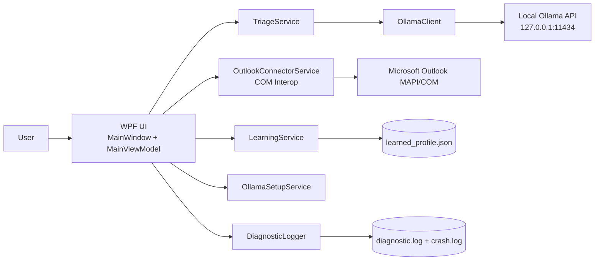
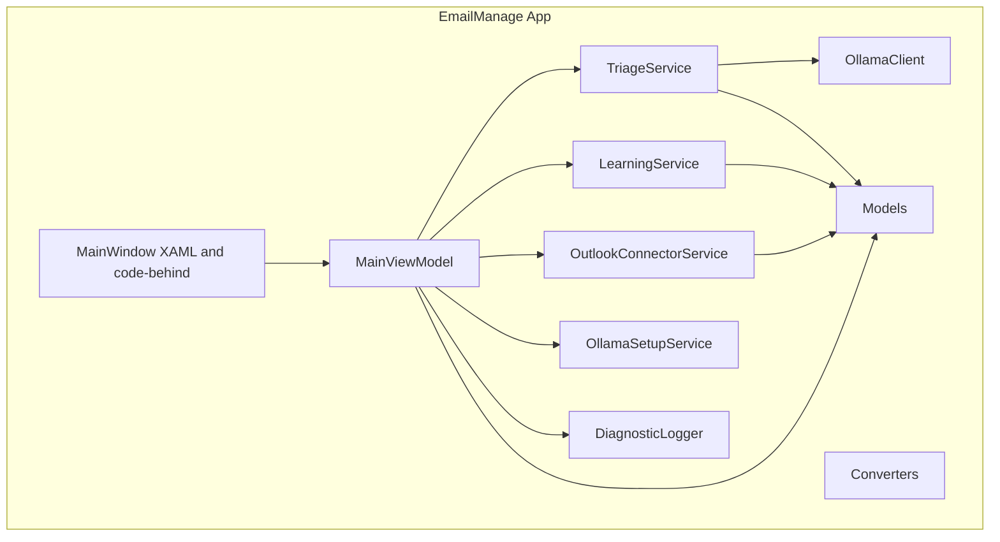
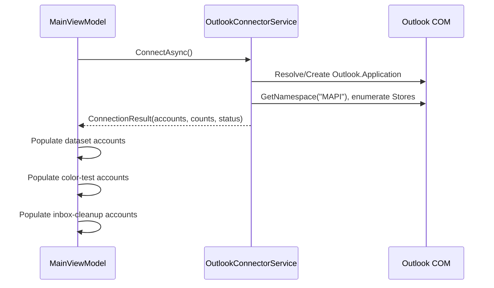
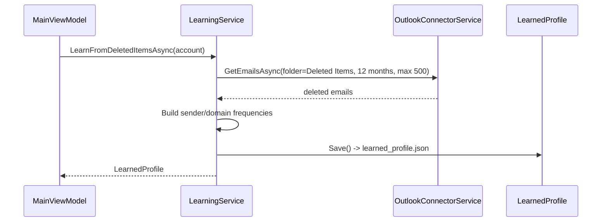
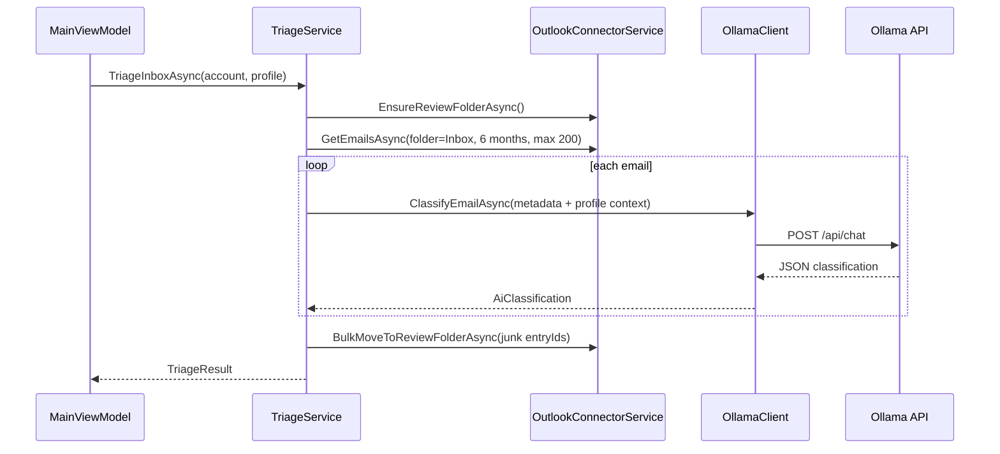
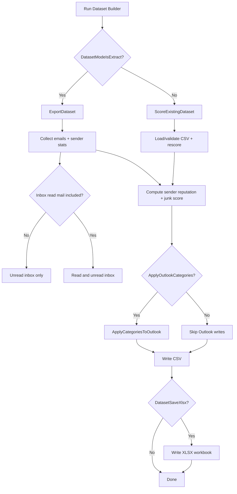

# MailZen Architecture and User Manual

## Document Control
- Product: MailZen
- Software Version: `1.1.2`
- Document Version: `1.1.2`
- Last Updated: `2026-03-11`
- Repository Path: `src/EmailManage.App`

Version sync rule:
- Keep `Software Version` and `Document Version` identical.
- When code changes in a release, update both:
1. `src/EmailManage.App/EmailManage.App.csproj` `<Version>`
2. This file header (`Software Version`, `Document Version`, `Last Updated`)
3. Visible UI version (bound from assembly metadata in `MainViewModel.AppVersion`)

---

## 1. Purpose and Scope
This document is the single technical reference for:
- How MailZen is designed.
- Where each capability lives in code.
- How to safely modify behavior.
- How to operate the product as an end user.

Audience:
- New developers joining the project.
- Maintainers changing workflow, scoring, Outlook COM interactions, AI behavior, or UI.
- Product owners and QA validating releases.

---

## 2. Solution Overview
MailZen is a Windows WPF desktop app that helps users clean Outlook email using:
- Rule-based dataset scoring.
- AI-assisted triage using local Ollama models.
- Outlook category tagging and folder movement workflows.
- Review safety step before deletion automation.

Core design characteristics:
- Single UI shell (`MainWindow.xaml`) using MVVM.
- One orchestrator ViewModel (`MainViewModel.cs`).
- Service layer for Outlook COM, learning, AI calls, setup, diagnostics.
- Local-first storage under `%LOCALAPPDATA%\EmailManage`.
- Strong operational logging and crash capture.

---

## 3. High-Level Architecture
### 3.1 Context Diagram


### 3.2 Container/Module Diagram


---

## 4. Repository and File Map
Top-level:
- `src/EmailManage.sln`: Solution entry.
- `src/EmailManage.App/EmailManage.App.csproj`: Dependencies, build metadata, product version (`1.1.2`).
- `MailZen.bat`: Build-and-run helper that publishes a fresh root `MailZen.exe`.
- `Docs/`: Product documentation.

Important app files:
- `src/EmailManage.App/App.xaml`: Resource dictionary and converters.
- `src/EmailManage.App/App.xaml.cs`: Startup/shutdown, global exception handling.
- `src/EmailManage.App/MainWindow.xaml`: Primary UI definition.
- `src/EmailManage.App/MainWindow.xaml.cs`: Window wiring and lifecycle hooks.
- `src/EmailManage.App/ViewModels/MainViewModel.cs`: App workflow state + command orchestration.

Services:
- `src/EmailManage.App/Services/OutlookConnectorService.cs`: Outlook COM operations and dataset/scoring engine.
- `src/EmailManage.App/Services/LearningService.cs`: Deleted-item learning profile generation.
- `src/EmailManage.App/Services/TriageService.cs`: AI-based inbox triage flow.
- `src/EmailManage.App/Services/OllamaClient.cs`: Ollama API calls and JSON parsing.
- `src/EmailManage.App/Services/OllamaSetupService.cs`: Ollama install/start/update/model pull.
- `src/EmailManage.App/Services/DiagnosticLogger.cs`: Structured logging.

Models:
- `OutlookAccountInfo.cs`: Account/store metadata.
- `EmailMessageInfo.cs`: Email transport object from Outlook.
- `FolderEmailSnapshot.cs`: Review folder snapshots.
- `LearnedProfile.cs`: Persistent personalization profile.
- `ConnectionResult.cs`: Connect status and account list.
- `ColorTestEmailItem.cs`: Color test preview item.

---

## 5. Runtime Lifecycle
1. `App.OnStartup` initializes logger, hooks unhandled exception handlers, shows `MainWindow`.
2. `MainWindow` restores saved window size/position/maximized state from local storage and constructs `MainViewModel`.
3. `Window_Loaded` calls `MainViewModel.InitializeAsync()`.
4. ViewModel connects to Outlook and hydrates account-dependent UI collections.
5. User executes workflow commands (learn/triage/review/dataset/settings utilities).
6. `Window_Closing` persists the current window layout.
7. `Window_Closed` calls `MainViewModel.Cleanup()`.
8. `App.OnExit` flushes logger.

Error capture:
- Unhandled UI exceptions: `DispatcherUnhandledException` -> `crash.log` + dialog.
- Domain exceptions: `AppDomain.UnhandledException` -> `crash.log`.

---

## 6. Core Workflows (Low-Level)
### 6.1 Connect and Account Discovery


### 6.2 Learn Profile from Deleted Items


### 6.3 Triage Inbox with AI


### 6.4 Dataset Builder (Unified Mode)


### 6.5 Settings Color Test + Global Cleanup
- Color Test path:
1. `FetchEmailPreview()` pulls small inbox sample per selected store.
2. `ApplyColorCodingTest()` applies `MailZen:*` categories and best-effort AutoFormatRules.
3. `CleanUpColorTest()` reverts categories/rules for selected preview rows.

- Global Inbox cleanup path:
1. `ClearInboxCategoriesCommand` confirms with user.
2. `ClearMailZenCategoriesFromInbox()` scans all Inbox items in selected stores.
3. Strips categories prefixed with `MailZen:`.
4. Optionally removes `MailZen:` view AutoFormatRules.

---

## 7. Data and Storage Contracts
### 7.1 Local Paths
- Logs: `%LOCALAPPDATA%\EmailManage\diagnostic.log` (rolling daily, keep 14 files)
- Crash log: `%LOCALAPPDATA%\EmailManage\crash.log`
- Learned profile: `%LOCALAPPDATA%\EmailManage\accounts\<accountKey>\learned_profile.json`
- Dataset defaults: `%LOCALAPPDATA%\EmailManage\dataset_defaults.json`
- Window layout: `%LOCALAPPDATA%\EmailManage\window_state.json`

### 7.2 LearnedProfile Schema
`LearnedProfile` fields:
- `AccountKey`
- `LearnedAt`
- `TotalDeletedScanned`
- `DeletedSenderCounts: Dictionary<string,int>`
- `DeletedDomainCounts: Dictionary<string,int>`
- `DoNotDeleteSenders: HashSet<string>`
- `RuleCreatedSenders: HashSet<string>`

### 7.3 Dataset CSV Contract
Required columns are validated by `OutlookConnectorService.RequiredCsvColumns`.
Output scored columns append:
- `SenderReputation`
- `JunkScore`
- `Recommendation`

---

## 8. Scoring Architecture
Current implementation is heuristic and code-defined (not user-tunable in UI):
- Sender reputation is derived from observed behaviors (read/delete/reply/unsubscribe patterns).
- Junk score combines signals such as unsubscribe presence, bulk indicators, folder context, and sender reputation.
- Recommendation thresholds map score to Keep/Review/Delete.

Primary file:
- `src/EmailManage.App/Services/OutlookConnectorService.cs`

Change guidance:
- For algorithm changes, modify only calculation functions and keep dataset column contract stable.
- If column names change, also update CSV validation and any data-science consumers.

---

## 9. Outlook COM and Threading Model
MailZen uses dynamic COM interop with STA requirements:
- COM work is wrapped in dedicated STA threads (`SetApartmentState(ApartmentState.STA)`).
- `RetryMessageFilter` is used to handle transient COM busy states.
- COM objects are explicitly released with `Marshal.ReleaseComObject`.

Safety notes:
- Cross-session `GetItemFromID` can fail depending on store/provider; where needed, code uses inbox iteration by `EntryID` matching instead.
- AutoFormatRules may fail for some account types (especially IMAP). The app handles this as best effort and logs warnings instead of hard failing core actions.

---

## 10. AI Integration Architecture
- Local endpoint: `http://127.0.0.1:11434`.
- Model default: `gemma3:4b`.
- Prompt strategy:
1. System instruction to return strict JSON only.
2. User prompt with sender, subject, body preview, unsubscribe hint.
3. Optional user-specific learned context prepended from `LearnedProfile`.

Robustness:
- Timeout handling.
- Parse fallback for markdown-wrapped JSON responses.
- Classification failures return error state instead of crashing workflow.

---

## 11. UI Architecture and Navigation
Main areas:
- Top Header: app identity, version badge, connection pill, settings gear.
- Tab 1: Cleanup Wizard.
- Tab 2: Dataset Builder (unified execution button with mode switch).
- Settings Overlay:
1. General tab (AI, accounts, profile, diagnostics, global inbox cleanup)
2. Color Test tab

MVVM binding patterns:
- Most actions are `[RelayCommand]` methods in `MainViewModel`.
- Boolean state controls visibility and command availability.
- Value converters are in `Helpers/Converters.cs`.

---

## 12. Developer Start Guide
If you need to change X, start in Y:
- Outlook connectivity, folder operations, moving emails -> `OutlookConnectorService.cs`
- AI prompt/classification behavior -> `OllamaClient.cs`
- Learn logic and profile persistence -> `LearningService.cs`, `LearnedProfile.cs`
- End-to-end triage flow -> `TriageService.cs`, `MainViewModel.cs`
- Dataset extraction/scoring outputs -> `OutlookConnectorService.cs`, `MainViewModel.cs`, `MainWindow.xaml`
- Settings UI and new controls -> `MainWindow.xaml`, `MainViewModel.cs`
- Version shown in UI -> `EmailManage.App.csproj`, `MainViewModel.cs`, `MainWindow.xaml`
- Logging format/retention -> `DiagnosticLogger.cs`

---

## 13. Build, Release, and Versioning Process
### 13.1 Build/Publish
Preferred local build-and-run command:
```bat
MailZen.bat
```

Equivalent publish command:
```powershell
dotnet publish src/EmailManage.App/EmailManage.App.csproj -c Release -r win-x64 --self-contained true -p:PublishSingleFile=true -p:IncludeNativeLibrariesForSelfExtract=true -o bin/Release/single-file
```

Result:
- Published single-file executable is copied to repository root as `MailZen.exe`.

### 13.2 Release Version Bump Checklist
For each release:
1. Update `<Version>` in `src/EmailManage.App/EmailManage.App.csproj`.
2. Verify header version shows in app title area and status bar.
3. Update this document header (`Software Version`, `Document Version`, date).
4. Publish and smoke test.
5. Tag release in git.

Recommended semantic versioning:
- Patch: bug fix, no behavior contract break (`1.1.1 -> 1.1.2`)
- Minor: backward-compatible feature addition (`1.1.1 -> 1.2.0`)
- Major: breaking change (`1.x -> 2.0.0`)

---

## 14. User Manual
### 14.1 Prerequisites
- Windows machine with Microsoft Outlook profile configured.
- Outlook data stores accessible (Exchange/IMAP/Outlook.com/PST as supported by Outlook).
- For AI features: Ollama installed and running locally, model available.

### 14.2 First Run
1. Launch MailZen.
2. Wait for connection status to become connected.
3. Open settings (gear) and verify AI status.
4. If AI is not ready, click install/setup controls in Settings > General.
5. On later launches, the main window reopens with the same size, position, and maximized state the user last used.

### 14.3 Cleanup Wizard Flow
1. Connect account and let MailZen learn from Deleted Items.
2. Run triage to classify inbox messages.
3. Review moved messages in "Review for Deletion".
4. Keep important emails (move back), delete junk, and optionally create sender rules.

### 14.4 Dataset Builder
Mode A: Extract from Outlook
1. Select accounts/folders/date range.
2. For Inbox extraction, leave `Include Read?` unchecked to focus on unread mail only, or check it to include read inbox mail too.
3. Optional: apply Outlook categories.
4. Optional: enable XLSX output.
5. Click `Run Dataset Builder`.

Mode B: Re-score existing CSV
1. Switch mode to `Re-score existing CSV`.
2. Browse and validate CSV.
3. Optional: apply Outlook categories.
4. Optional: enable XLSX output.
5. Click `Run Dataset Builder`.

### 14.5 Color Test (Settings > Color Test)
1. Select accounts.
2. Load preview.
3. Run test to apply temporary MailZen categories and formatting cues.
4. Use cleanup button to remove test categories/rules.

### 14.6 Global Inbox Category Cleanup (Settings > General)
1. Select target accounts.
2. Optional: include formatting rule removal.
3. Click `Clear MailZen Categories from Inbox`.
4. Confirm warning prompt.
5. Monitor result text for scanned/cleared counts.

### 14.7 Diagnostics and Logs
- Use `Open Log Folder` in Settings > General.
- Collect `diagnostic.log` and `crash.log` when reporting issues.

### 14.8 Troubleshooting
- Outlook disconnected: restart Outlook first, then retry MailZen connection.
- AI unavailable: ensure Ollama is installed, running, and model is pulled.
- Category formatting not visible: some store types do not support view AutoFormatRules; category tags can still apply.
- Long runs: check status panel and logs for progress; large inboxes can take time.

---

## 15. Maintenance Notes
When adding a new feature:
1. Add/adjust ViewModel command and state properties.
2. Add UI binding in `MainWindow.xaml`.
3. Implement service-layer behavior with cancellation/progress support.
4. Add error logging with actionable context.
5. Update this document's architecture and user manual sections.
6. Keep version sync rule intact.
